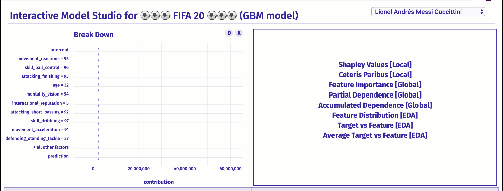
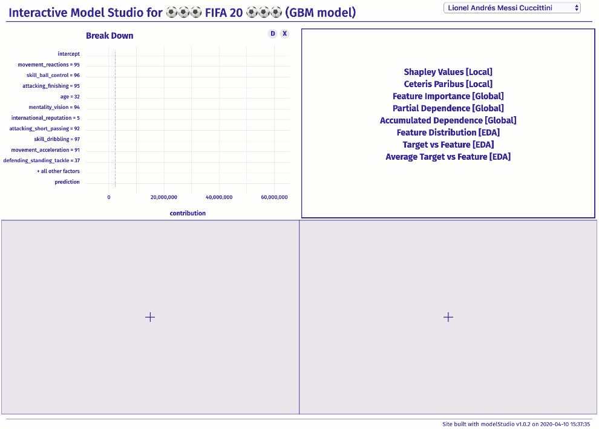

# Interactive Studio for Explanatory Model Analysis 

[](https://cran.r-project.org/package=modelStudio)
[](https://github.com/ModelOriented/modelStudio/actions?query=workflow%3AR-CMD-check)
[](https://codecov.io/github/ModelOriented/modelStudio?branch=master)
[](http://drwhy.ai/#AutoMat)
[](https://joss.theoj.org/papers/9eec8c9d1969fbd44b3ea438a74af911)

## Overview

The `modelStudio` package **automates the Explanatory Analysis of Machine Learning predictive models**. Generate advanced interactive and animated model explanations in the form of a **serverless HTML site** with only one line of code. This tool is model agnostic, therefore compatible with most of the black box predictive models and frameworks (e.g.&nbsp;`mlr/mlr3`, `xgboost`, `caret`, `h2o`, `scikit-learn`, `lightGBM`, `keras/tensorflow`).

The main `modelStudio()` function computes various (instance and dataset level) model explanations and produces an **interactive,&nbsp;customisable dashboard made with D3.js**. It consists of multiple panels for plots with their short descriptions. Easily&nbsp;**save&nbsp;and&nbsp;share** the dashboard with others. Tools for model exploration unite with tools for EDA (Exploratory Data Analysis) to give a broad overview of the model behavior.

<p alig="center">
<!--- [explain FIFA19](https://pbiecek.github.io/explainFIFA19/) &emsp; --->
[**explain FIFA20**](https://pbiecek.github.io/explainFIFA20/) &emsp;
<!--- [explain Lung Cancer](https://github.com/hbaniecki/transparent_xai/) &emsp; --->
[**R & Python examples**](http://modelstudio.drwhy.ai/articles/vignette_examples.html) &emsp;
[**More Resources**](http://modelstudio.drwhy.ai/#more-resources) &emsp;
[**FAQ & Troubleshooting**](https://github.com/ModelOriented/modelStudio/issues/54)

</p>



The `modelStudio` package is a part of the [**DrWhy.AI**](http://drwhy.ai) universe.

## Installation

```r
# Install from CRAN:
install.packages("modelStudio")

# Install the development version from GitHub:
devtools::install_github("ModelOriented/modelStudio")
```

## Simple Demo

```r
library("DALEX")
library("modelStudio")

# fit a model
model <- glm(survived ~.,
             data = titanic_imputed,
             family = "binomial")

# create an explainer for the model    
explainer <- explain(model,
                     data = titanic_imputed,
                     y = titanic_imputed$survived,
                     label = "Titanic GLM")

# pick observations
new_observations <- titanic_imputed[1:4,]
rownames(new_observations) <- c("Lucas", "James", "Thomas", "Nancy")

# make a studio for the model
modelStudio(explainer, new_observations)
```

[Save the output](http://modelstudio.drwhy.ai/#save--share) in the form of a HTML file - [**Demo Dashboard**](https://modeloriented.github.io/modelStudio/demo.html).



## R & Python Examples [more](http://modelstudio.drwhy.ai/articles/vignette_examples.html)

The `modelStudio()` function takes `DALEX` explainers (created with `DALEX::explain()` or `DALEXtra::explain_*()`) as an input.  

```r
# update main dependencies
install.packages("ingredients")
install.packages("iBreakDown")

# packages for explainer objects
install.packages("DALEX")
install.packages("DALEXtra")
```

### mlr [dashboard](https://modeloriented.github.io/modelStudio/mlr.html)

```r
# load packages and data
library(mlr)
library(DALEXtra)
library(modelStudio)

data <- DALEX::titanic_imputed

# split the data
index <- sample(1:nrow(data), 0.8*nrow(data))
train <- data[index, ]
test <- data[-index, ]

# mlr ClassifTask takes target as factor
train$survived <- as.factor(train$survived)

# fit a model
task <- makeClassifTask(id = "titanic",
                        data = train,
                        target = "survived")

learner <- makeLearner("classif.ranger",
                       predict.type = "prob")

model <- train(learner, task)

# create an explainer for the model
explainer <- explain_mlr(model,
                         data = test,
                         y = test$survived,
                         label = "mlr")

# pick observations
new_observation <- test[1:2, ]
rownames(new_observation) <- c("id1", "id2")

# make a studio for the model
modelStudio(explainer,
            new_observation)
```

### xgboost [dashboard](https://modeloriented.github.io/modelStudio/xgboost.html)

```r
# load packages and data
library(xgboost)
library(DALEX)
library(modelStudio)

data <- DALEX::titanic_imputed

# split the data
index <- sample(1:nrow(data), 0.8*nrow(data))
train <- data[index, ]
test <- data[-index, ]

train_matrix <- model.matrix(survived ~.-1, train)
test_matrix <- model.matrix(survived ~.-1, test)

# fit a model
xgb_matrix <- xgb.DMatrix(train_matrix, label = train$survived)
params <- list(eta = 0.01, subsample = 0.6, max_depth = 7, min_child_weight = 3,
               objective = "binary:logistic", eval_metric = "auc")
model <- xgb.train(params, xgb_matrix, nrounds = 1000)

# create an explainer for the model
explainer <- explain(model,
                     data = test_matrix,
                     y = test$survived,
                     label = "xgboost")

# pick observations
new_observation <- test_matrix[1:2,,drop=FALSE]
rownames(new_observation) <- c("id1", "id2")

# make a studio for the model
modelStudio(explainer,
            new_observation,
            options = modelStudioOptions(margin_left = 140))
```

### scikit-learn [dashboard](https://modeloriented.github.io/modelStudio/scikitlearn.html)

The `modelStudio()` function takes `dalex` explainers (created with `dalex.Explainer`) as an input.

```bash
pip3 install dalex --force
```

Use `pickle` Python module and `reticulate` R package to easily make a studio for a model.

In this example we will fit a `Pipeline MLPClassifier` model on titanic data. 

First, use `dalex` in Python:

```python
# load packages and data
import dalex as dx

from sklearn.model_selection import train_test_split
from sklearn.pipeline import Pipeline
from sklearn.preprocessing import StandardScaler, OneHotEncoder
from sklearn.impute import SimpleImputer
from sklearn.compose import ColumnTransformer
from sklearn.neural_network import MLPClassifier

data = dx.datasets.load_titanic()
X = data.drop(columns='survived')
y = data.survived

# split the data
X_train, X_test, y_train, y_test = train_test_split(X, y, test_size=0.33, random_state=1)

# fit a pipeline model
numeric_features = ['age', 'fare', 'sibsp', 'parch']
numeric_transformer = Pipeline(
  steps=[
    ('imputer', SimpleImputer(strategy='median')),
    ('scaler', StandardScaler())
    ]
)
categorical_features = ['gender', 'class', 'embarked']
categorical_transformer = Pipeline(
  steps=[
    ('imputer', SimpleImputer(strategy='constant', fill_value='missing')),
    ('onehot', OneHotEncoder(handle_unknown='ignore'))
    ]
)

preprocessor = ColumnTransformer(
  transformers=[
    ('num', numeric_transformer, numeric_features),
    ('cat', categorical_transformer, categorical_features)
    ]
)

model = Pipeline(
  steps=[
    ('preprocessor', preprocessor),
    ('classifier', MLPClassifier(hidden_layer_sizes=(150,100,50), max_iter=500, random_state=0))
    ]
)
model.fit(X_train, y_train)

# create an explainer for the model
explainer = dx.Explainer(model, X_test, y_test, label = 'scikit-learn')

#! remove residual_function before dump !
explainer.residual_function = None

# pack the explainer into a pickle file
import pickle
pickle_out = open("explainer_scikitlearn.pickle","wb")
pickle.dump(explainer, pickle_out)
pickle_out.close()
```

Then, use `modelStudio` in R:

```r
# load the explainer from the pickle file
library(reticulate)
explainer <- py_load_object('explainer_scikitlearn.pickle', pickle = "pickle")

# make a studio for the model
library(modelStudio)
modelStudio(explainer)
```

## Save & Share

Save `modelStudio` as a HTML file using buttons on the top of the RStudio Viewer
or with [`r2d3::save_d3_html()`](https://rstudio.github.io/r2d3/articles/publishing.html#save-as-html).

<p align="center">
  
</p>

## More Resources

  - Theoretical introduction to the plots: [Explanatory Model Analysis. Explore, Explain and Examine Predictive Models.](https://pbiecek.github.io/ema)

  - Vignette: [modelStudio - R & python examples](https://modeloriented.github.io/modelStudio/articles/vignette_examples.html)  
  
  - Vignette: [modelStudio - perks and features](https://modeloriented.github.io/modelStudio/articles/vignette_modelStudio.html)  

  - Conference poster: [MLinPL2019](misc/MLinPL2019_modelStudio_poster.pdf)

<!--  - [Article about modelStudio](https://joss.theoj.org/papers/10.21105/joss.01798) -->

  - [News](NEWS.md)


## Acknowledgments

Work on this package was financially supported by the `NCN Opus grant 2016/21/B/ST6/02176`.
