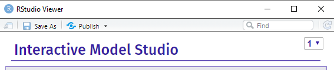

# Interactive Studio for Explanatory Model Analysis

<p align="center">

</p>

[](https://cran.r-project.org/package=modelStudio)
[](https://github.com/ModelOriented/modelStudio/actions?query=workflow%3AR-CMD-check)
[](https://app.codecov.io/gh/ModelOriented/modelStudio?branch=master)
[](https://cranlogs.r-pkg.org/badges/grand-total/modelStudio)
[](https://joss.theoj.org/papers/9eec8c9d1969fbd44b3ea438a74af911)

## Overview

The `modelStudio` package **automates the explanatory analysis of machine learning predictive models**. It generates advanced interactive model explanations in the form of a **serverless HTML site** with only one line of code. This tool is model-agnostic, therefore compatible with most of the black-box predictive models and frameworks (e.g.&nbsp;`mlr/mlr3`, `xgboost`, `caret`, `h2o`, `parsnip`, `tidymodels`, `scikit-learn`, `lightgbm`, `keras/tensorflow`).

The main `modelStudio()` function computes various (instance and model-level) explanations and produces a&nbsp;**customisable dashboard**, which consists of multiple panels for plots with their short descriptions. It is possible to easily **save** the dashboard and&nbsp;**share** it with others. Tools for [Explanatory Model Analysis](https://ema.drwhy.ai) unite with tools for Exploratory Data Analysis to give a broad overview of the model behavior.

<p align="center"><b>
<a href="https://rai-covid.drwhy.ai">explain COVID-19<a> &emsp;
<a href="http://modelstudio.drwhy.ai/articles/ms-r-python-examples.html">R & Python examples<a> &emsp;
<a href="http://modelstudio.drwhy.ai/#more-resources">More resources<a> &emsp;
<a href="https://iema.drwhy.ai">Interactive EMA<a> &emsp;
</b></p>

[](https://modelstudio.drwhy.ai/demo.html)

The `modelStudio` package is a part of the [**DrWhy.AI**](http://drwhy.ai) universe.

## Installation

```r
# Install from CRAN:
install.packages("modelStudio")

# Install the development version from GitHub:
devtools::install_github("ModelOriented/modelStudio")
```

## Simple demo

```r
library("DALEX")
library("ranger")
library("modelStudio")

# fit a model
model <- ranger(score ~., data = happiness_train)

# create an explainer for the model    
explainer <- explain(model,
                     data = happiness_test,
                     y = happiness_test$score,
                     label = "Random Forest")

# make a studio for the model
modelStudio(explainer)
```

[Save the output](https://modelstudio.drwhy.ai/#save--share) in the form of a HTML file - [**Demo Dashboard**](https://modelstudio.drwhy.ai/demo.html).

[](https://modelstudio.drwhy.ai/demo.html)

## R & Python examples [more](https://modelstudio.drwhy.ai/articles/ms-r-python-examples.html)

-------------------------------

The `modelStudio()` function uses `DALEX` explainers created with `DALEX::explain()` or `DALEXtra::explain_*()`.

```r
# packages for the explainer objects
install.packages("DALEX")
install.packages("DALEXtra")
```

### mlr [dashboard](https://modelstudio.drwhy.ai/mlr.html)

Make a studio for the regression `ranger` model on the `apartments` data.

<details open>
<summary><strong><em>code</em></strong></summary>

```r
# load packages and data
library(mlr)
library(DALEXtra)
library(modelStudio)

data <- DALEX::apartments

# split the data
index <- sample(1:nrow(data), 0.7*nrow(data))
train <- data[index,]
test <- data[-index,]

# fit a model
task <- makeRegrTask(id = "apartments", data = train, target = "m2.price")
learner <- makeLearner("regr.ranger", predict.type = "response")
model <- train(learner, task)

# create an explainer for the model
explainer <- explain_mlr(model,
                         data = test,
                         y = test$m2.price,
                         label = "mlr")

# pick observations
new_observation <- test[1:2,]
rownames(new_observation) <- c("id1", "id2")

# make a studio for the model
modelStudio(explainer, new_observation)
```

</details>

### xgboost [dashboard](https://modelstudio.drwhy.ai/xgboost.html)

Make a studio for the classification `xgboost` model on the `titanic` data.

<details>
<summary><strong><em>code</em></strong></summary>

```r
# load packages and data
library(xgboost)
library(DALEX)
library(modelStudio)

data <- DALEX::titanic_imputed

# split the data
index <- sample(1:nrow(data), 0.7*nrow(data))
train <- data[index,]
test <- data[-index,]

train_matrix <- model.matrix(survived ~.-1, train)
test_matrix <- model.matrix(survived ~.-1, test)

# fit a model
xgb_matrix <- xgb.DMatrix(train_matrix, label = train$survived)
params <- list(max_depth = 3, objective = "binary:logistic", eval_metric = "auc")
model <- xgb.train(params, xgb_matrix, nrounds = 500)

# create an explainer for the model
explainer <- explain(model,
                     data = test_matrix,
                     y = test$survived,
                     type = "classification",
                     label = "xgboost")

# pick observations
new_observation <- test_matrix[1:2, , drop=FALSE]
rownames(new_observation) <- c("id1", "id2")

# make a studio for the model
modelStudio(explainer, new_observation)
```

</details>

-------------------------

The `modelStudio()` function uses `dalex` explainers created with `dalex.Explainer()`.

```console
:: package for the Explainer object
pip install dalex -U
```

Use `pickle` Python module and `reticulate` R package to easily make a studio for a model.

```r
# package for pickle load
install.packages("reticulate")
```

### scikit-learn [dashboard](https://modelstudio.drwhy.ai/scikitlearn.html)

Make a studio for the regression `Pipeline SVR` model on the `fifa` data.

<details>
<summary><strong><em>code</em></strong></summary>

First, use `dalex` in Python:

```python
# load packages and data
import dalex as dx
from sklearn.model_selection import train_test_split
from sklearn.pipeline import Pipeline
from sklearn.preprocessing import StandardScaler
from sklearn.svm import SVR
from numpy import log

data = dx.datasets.load_fifa()
X = data.drop(columns=['overall', 'potential', 'value_eur', 'wage_eur', 'nationality'], axis=1)
y = log(data.value_eur)

# split the data
X_train, X_test, y_train, y_test = train_test_split(X, y)

# fit a pipeline model
model = Pipeline([('scale', StandardScaler()), ('svm', SVR())])
model.fit(X_train, y_train)

# create an explainer for the model
explainer = dx.Explainer(model, data=X_test, y=y_test, label='scikit-learn')

# pack the explainer into a pickle file
explainer.dump(open('explainer_scikitlearn.pickle', 'wb'))
```

Then, use `modelStudio` in R:

```r
# load the explainer from the pickle file
library(reticulate)
explainer <- py_load_object("explainer_scikitlearn.pickle", pickle = "pickle")

# make a studio for the model
library(modelStudio)
modelStudio(explainer, B = 5)
```

</details>

### lightgbm [dashboard](https://modelstudio.drwhy.ai/lightgbm.html)

Make a studio for the classification `Pipeline LGBMClassifier` model on the `titanic` data.

<details>
<summary><strong><em>code</em></strong></summary>

First, use `dalex` in Python:

```python
# load packages and data
import dalex as dx
from sklearn.model_selection import train_test_split
from sklearn.pipeline import Pipeline
from sklearn.preprocessing import StandardScaler, OneHotEncoder
from sklearn.impute import SimpleImputer
from sklearn.compose import ColumnTransformer
from lightgbm import LGBMClassifier

data = dx.datasets.load_titanic()
X = data.drop(columns='survived')
y = data.survived

# split the data
X_train, X_test, y_train, y_test = train_test_split(X, y)

# fit a pipeline model
numerical_features = ['age', 'fare', 'sibsp', 'parch']
numerical_transformer = Pipeline(
  steps=[
    ('imputer', SimpleImputer(strategy='median')),
    ('scaler', StandardScaler())
  ]
)
categorical_features = ['gender', 'class', 'embarked']
categorical_transformer = Pipeline(
  steps=[
    ('imputer', SimpleImputer(strategy='constant', fill_value='missing')),
    ('onehot', OneHotEncoder(handle_unknown='ignore'))
  ]
)

preprocessor = ColumnTransformer(
  transformers=[
    ('num', numerical_transformer, numerical_features),
    ('cat', categorical_transformer, categorical_features)
  ]
)

classifier = LGBMClassifier(n_estimators=300)

model = Pipeline(
  steps=[
    ('preprocessor', preprocessor),
    ('classifier', classifier)
  ]
)
model.fit(X_train, y_train)

# create an explainer for the model
explainer = dx.Explainer(model, data=X_test, y=y_test, label='lightgbm')

# pack the explainer into a pickle file
explainer.dump(open('explainer_lightgbm.pickle', 'wb')) 
```

Then, use `modelStudio` in R:

```r
# load the explainer from the pickle file
library(reticulate)
explainer <- py_load_object("explainer_lightgbm.pickle", pickle = "pickle")

# make a studio for the model
library(modelStudio)
modelStudio(explainer)
```

</details>

-------------------------------

## Save & share

Save `modelStudio` as a HTML file using buttons on the top of the RStudio Viewer
or with [`r2d3::save_d3_html()`](https://rstudio.github.io/r2d3/articles/publishing.html#save-as-html).

<p align = "center", style="text-align: center;">
  
</p>

## Citations

If you use `modelStudio`, please cite our [JOSS article](https://joss.theoj.org/papers/10.21105/joss.01798):

```
@article{baniecki2019modelstudio,
  title   = {{modelStudio: Interactive Studio with Explanations for ML Predictive Models}},
  author  = {Hubert Baniecki and Przemyslaw Biecek},
  journal = {Journal of Open Source Software},
  year    = {2019},
  volume  = {4},
  number  = {43},
  pages   = {1798},
  url     = {https://doi.org/10.21105/joss.01798}
}
```

For a description and evaluation of the Interactive EMA process, refer to our [DAMI article](https://doi.org/10.1007/s10618-023-00924-w):

```
@article{baniecki2023grammar,
  title   = {The grammar of interactive explanatory model analysis},
  author  = {Hubert Baniecki and Dariusz Parzych and Przemyslaw Biecek},
  journal = {Data Mining and Knowledge Discovery},
  year    = {2023},
  pages   = {1--37},
  url     = {https://doi.org/10.1007/s10618-023-00924-w}
}
```

## More resources
  
  - Introduction to the plots: [Explanatory Model Analysis: Explore, Explain, and Examine Predictive Models](https://ema.drwhy.ai)

  - Vignettes: [perks and features](https://modelstudio.drwhy.ai/articles/ms-perks-features.html), [R & Python examples](https://modelstudio.drwhy.ai/articles/ms-r-python-examples.html), [modelStudio in R Markdown HTML](https://modelstudio.drwhy.ai/articles/ms-rmarkdown.html)   
  
  - Changelog: [NEWS](https://modelstudio.drwhy.ai/news/index.html)
    
  - Conference poster: [ML in PL 2019](https://github.com/ModelOriented/modelStudio/blob/master/misc/MLinPL2019_modelStudio_poster.pdf)
  
  
## Acknowledgments

Work on this package was financially supported by the National Science Centre (Poland) grant `2016/21/B/ST6/02176` and National Centre for Research and Development grant `POIR.01.01.01-00-0328/17`.
