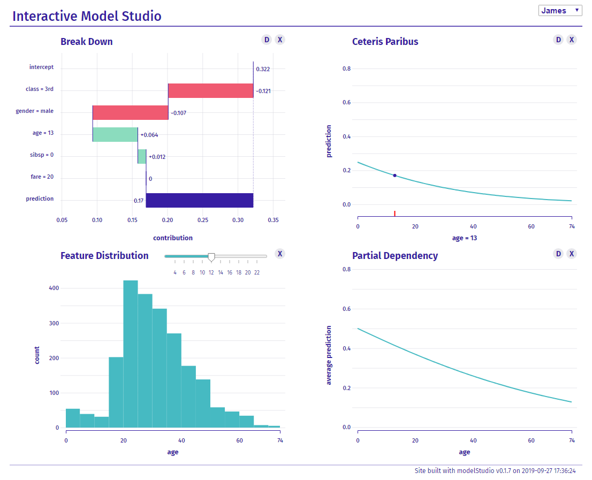

# Introduction

Machine learning predictive models are widely used in many areas of
bussiness and research. Their rising popularity is due to them beeing
effective but often lead to problems with explaining their prediction.
This has led to development of many Interpretable Machine Learning
tools, e.g. `DALEX` [@2018arXiv180608915B] R package, `lime` [@lime] and
`shap` [@NIPS2017_7062] Python packages and `H2o.ai Driverless AI` [@Gill2017MachineLI].

Nowadays, we can see huge demand for automation in many areas. This is
how Automated Machine Learning and Automated Exploratory Data Analysis
have came to existance. AutoML [@Truong2019TowardsAM] and AutoEDA [@2018arXiv180401955S]
tools not only speed up the model development process
but also often lead to new discoveries or higher quality of models.

Explaining predictive models might be a time consuming and tedious task. 
Libraries for interpretable machine learning [@DALEX], [@iml], [@tfexplain], [@sklearnexplain], [@InterpretML] require high programing skills and endless exploration of different aspects of a predictive model.

There are tools for automation of the XAI process like `modelDown` [@Romaszko2019] which generates static HTML site and
compares various models and explains them. But such tools generate static reports and are focused on global level explanations.  

# The `modelStudio` package

The `modelStudio` R package automates the process of model exploration. It generates advanced interactive and animated model explanations in the form of serverless HTML site. It combines **R** [@R] with **D3.js** [@bostock2016d3] to produce plots and descriptions for various local and global explanations. Tools for model exploration are enriched with tools for data exploration EDA to give broad overview of the model behavior. 

The usage of `modelStudio` is meant to be intuitive and simple to use. The computation time needed to produce the output might not be short though.
The main goal of `modelStudio` is to make model explaining more automated and achieve higher quality explanations by juxtaposition of complementary aspects of a model.

Comparing instance level explanations and model level
explanations side by side adds wider context and allows for deeper understanding. 
`modelStudio` helps to study relations between various methods for model explanation like *Break Down*, *SHAP*, *Partial Dependency Plots*, *Feature Importance* and others.


# Example

The package `modelStudio` is available on [CRAN](https://CRAN.R-project.org/package=modelStudio). It can be installed
using the `install.packages('modelStudio')` command. This package bases
on `DALEX` explainers created with `DALEX::explain()`. Below basic code
example, which produces [demo](https://modeloriented.github.io/modelStudio/demo.html).

``` r
library("modelStudio")

# Prepare data
titanic_small <- DALEX::titanic_imputed[, c(1,2,3,6,7,9)]
titanic_small$survived <- titanic_small$survived == "yes"

# Create a model
model <- glm(survived ~.,
             data = titanic_small,
             family = "binomial")
                 
# Wrap it into an explainer        
explainer <- DALEX::explain(model,
                            data = titanic_small[,-6],
                            y = titanic_small[,6],
                            label = "glm")
                   
# Pick some data points
new_observations <- titanic_small[1:4,]
rownames(new_observations) <- c("Lucas", "James", "Thomas", "Nancy")

# Make a studio for the model
modelStudio(explainer, new_observations)
```



# Key Features

Generated HTML site has many interactive features. One can choose
which plots are displayed on the grid and change them at any given
moment by clicking on the X symbol. Use the drop down list to pick the
observation, that will be considered for local explanation plots. Plots
that use a variable as their dimension can be changed through clicking
on bars of other plots. Mouse over D symbol next to explanations to
display text descriptions. Finally, mouse over lines and bars to disply
the
tooltip.


# Explanations

Seven possible plots to chose from are implemented. There are three
local explanations, three global explanations and feature density plot.

**Local explanations** are designed to better understand model behaviour
around a single observation.

  - **Break Down** plot and **SHAP Values** [@NIPS2017_7062]
    plot present variable contributions to a model prediction [@gosiewska2019ibreakdown].
    Both of them come from `iBreakDown` [@iBreakDown] R package.

  - **Ceteris Paribus** plot presents model responses around a single
    point in the feature space [@ceterisParibus].

**Global explanations** are designed to better understand how the model
works in general, for some population of interest.

  - **Feature Importance** plot presents permutation based feature
    importance [@fisher2018all].

  - **Partial Dependency** plot presents averages from N number of
    Ceteris Paribus Profiles [@RJ-2017-016].

  - **Accumulated Dependency** plot presents accumulated local changes
    in Ceteris Paribus Profiles [@apley2016visualizing].

Detailed overview of those methods can be found in “Predictive Models:
Explore, Explain, and Debug” [@pmeed]. Last explanations are implemented 
in the `ingredients` [@ingredients] R package.

# Conclusions

The `modelStudio` package is easy to use and its output is intuitive to
explore. Automation is convenient and interactivity adds another
dimension to visualisations. All of this enhance explanation of machine
learning predictive models. More features and examples can be found in
the vignette: [modelStudio - perks and features](https://modeloriented.github.io/modelStudio/articles/vignette_modelStudio.html)
and on the [GitHub](https://github.com/ModelOriented/modelStudio).

# Acknowledgments

Work on this package was financially supported by the ‘NCN Opus grant 2016/21/B/ST6/02176’.

# References
